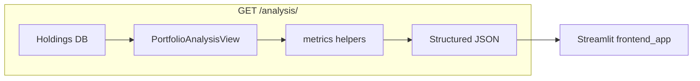

# Production fintech dashboard upgrade (extend existing code)

## Current baseline (already in repo)

- P/L and per-row data are built in [`PortfolioAnalysisView.get`](d:\portfolio-analyzer\analytics\views.py); pricing uses [`fetch_last_close`](d:\portfolio-analyzer\analytics\services.py).
- Each row already includes **`price_available`**; summary already has **`priced_holdings_count`** / **`total_holdings_count`**.
- API today: `success`, `summary`, **`stocks`** ([`AnalysisResponseSerializer`](d:\portfolio-analyzer\analytics\serializers.py)). Only [`frontend_app.py`](d:\portfolio-analyzer\frontend_app.py) reads `stocks`, so renaming to **`holdings`** is low risk.

## Step 1 — Loss recovery (summary)

Add two fields to **summary** (and document in serializer):

- Derive portfolio **`profit_loss_percent`** as today (unchanged).
- When `profit_loss_percent` is negative (drawdown), set:
  - **`loss_percent`**: same numeric value as `profit_loss_percent` (negative %), so it stays consistent with existing P/L %.
  - **`recovery_needed_percent`**:  
    `abs(loss_percent) / (100 - abs(loss_percent)) * 100`  
    Guard: if `abs(loss_percent) >= 100`, return `None` and avoid division by zero (total-loss edge case).
- When not in loss (`profit_loss_percent` is `None` or `>= 0`): `loss_percent` and `recovery_needed_percent` can be `None` (or `0` for recovery—pick one and keep serializers consistent).

Implement the formula in a small pure function (e.g. `_recovery_needed_percent(loss_pct: Decimal) -> Decimal | None`) in a new module **[`analytics/metrics.py`](d:\portfolio-analyzer\analytics\metrics.py)** (or similar) to keep [`views.py`](d:\portfolio-analyzer\analytics\views.py) thin and testable.

## Step 2 — Top gainers and losers

After `stocks_data` is built (only rows with **`price_available`** and non-null **`profit_loss`**):

- **`top_gainers`**: sort by **`profit_loss`** descending, take **3**.
- **`top_losers`**: sort by **`profit_loss`** ascending, take **3**.

Reuse **`StockPerformanceSerializer`** for list items (same schema as holdings lines) or add a thin serializer if you want a subset—prefer **reuse** to avoid duplication.

## Step 3 — Smart insights engine

Add **`compute_insights(...)`** in [`analytics/metrics.py`](d:\portfolio-analyzer\analytics\metrics.py) (or `insights.py`) returning `list[str]`:

| Rule | Condition | Example message |
|------|-----------|-----------------|
| Concentration | Single holding’s **`current_value`** / **sum of priced `current_value`** > **0.4** | `"High concentration in {stock_name}"` |
| Drawdown | Portfolio **`profit_loss_percent`** < **-30** | `"Portfolio under heavy drawdown"` (or align with your example wording) |
| Data quality | **`missing_price_count` / total_holdings** > **0.2** (and `total_holdings > 0`) | `"Data quality issue: many holdings missing live prices"` |

Use **priced** values only for concentration denominator (same as “portfolio value” used elsewhere). If no priced rows, skip concentration or skip with a safe branch.

## Step 4 — Missing prices

- **`missing_price_count`** = `len(holdings) - priced_count` (equivalently count `not price_available`).
- Per-stock **`price_available`** is already returned; keep it and ensure Streamlit/API docs reflect it.

## Step 5–7 — Streamlit ([`frontend_app.py`](d:\portfolio-analyzer\frontend_app.py))

1. **KPI row**: Total investment, Current value, Profit/Loss, **Loss %** (show summary `loss_percent` or `—`), **Recovery %** (`recovery_needed_percent` or `—`).
2. **Insights**: loop `data["insights"]` — use **`st.error`** or **`st.markdown`** with red HTML if you need true red (Streamlit’s **`st.warning`** is amber; your spec asked for red—prefer **`st.error`** per line or a small HTML block).
3. **Top gainers / losers**: two **`st.dataframe`** tables from `top_gainers` / `top_losers`.
4. **Holdings**: build a **`pandas.Styler`** or column-specific formatting so **profit** rows/cells green and **loss** red (e.g. style `profit_loss` column), or use `st.dataframe` with PyArrow/Pandas styling if supported by your Streamlit version.
5. **Missing price**: if **`missing_price_count > 0`**, call **`st.error`** with a clear message before tables.
6. **Pie chart**: from priced holdings, take **top 5** by **`current_value`**; bucket the rest as **"Others"**; use **`st.pyplot`** + matplotlib (already used for bar chart) or **`st.plotly_chart`** if you add plotly—matplotlib keeps deps minimal.

**Search / filter** (below KPIs, above holdings table):

- Text input: substring match on **`stock_name`**.
- Selectbox: **All** | **Profit** | **Loss** — filter rows where `profit_loss` is `> 0`, `< 0`, or unfiltered (exclude `None` P/L from Profit/Loss filters or show as separate caption).

Cache analysis in `st.session_state` as today; after upload success, clear cache so refresh picks up new data.

## Step 8 — Clean API response

Update [`AnalysisResponseSerializer`](d:\portfolio-analyzer\analytics\serializers.py):

```text
success, summary, holdings, top_gainers, top_losers, insights, missing_price_count
```

- Rename field **`stocks` → `holdings`** in [`PortfolioAnalysisView`](d:\portfolio-analyzer\analytics\views.py) output.
- Add **`insights`**: `ListField(child=CharField())` or `serializers.ListField(serializers.CharField())`.
- Add **`missing_price_count`**: `IntegerField()`.
- Add **`top_gainers` / `top_losers`**: `StockPerformanceSerializer(many=True)` (or dedicated serializer).

Extend **`AnalysisSummarySerializer`** with **`loss_percent`** and **`recovery_needed_percent`** (`DecimalField`, `allow_null=True`).

Validate the full payload with the updated response serializer before `return Response(...)`.

## Step 9 — Code quality

- New helpers: recovery math, insight rules, top-N selection—**single place** ([`analytics/metrics.py`](d:\portfolio-analyzer\analytics\metrics.py)).
- Short module docstring + focused comments on edge cases (XIRR unchanged; recovery denominator).
- No unrelated refactors of CSV upload or auth.

## Step 10 — Final verification (manual)

- `python manage.py check` / runserver: hit **`GET /analysis/`** with auth; confirm JSON keys and types.
- Run Streamlit: login → upload CSV → refresh; confirm KPIs, insights, tables, pie, filters, and error for missing prices.



---

**Files to touch (expected)**

| File | Change |
|------|--------|
| [`analytics/metrics.py`](d:\portfolio-analyzer\analytics\metrics.py) | **New**: recovery %, insights, top gainers/losers |
| [`analytics/views.py`](d:\portfolio-analyzer\analytics\views.py) | Call helpers; assemble summary + response; `holdings` key |
| [`analytics/serializers.py`](d:\portfolio-analyzer\analytics\serializers.py) | Extended summary + response schema |
| [`frontend_app.py`](d:\portfolio-analyzer\frontend_app.py) | UI sections per steps 5–7; read `holdings` and new fields |

---

**English / हिंदी / ગુજરાતી (short)**

- **EN**: Extend analytics with recovery math, rankings, and insights; unify API shape; upgrade Streamlit without breaking upload/auth.
- **HI**: मौजूदा Django/DRF/Streamlit को बढ़ाएँ — नए मेट्रिक्स, insights, और साफ JSON; पुराना व्यवहार तोड़े बिना।
- **GU**: હાલનો પ્રોજેક્ટ વિસ્તૃત કરો — નવા મેટ્રિક્સ અને UI; API સ્ટ્રક્ચર સ્પષ્ટ; જૂની સુવિધાઓ સાચવો.
