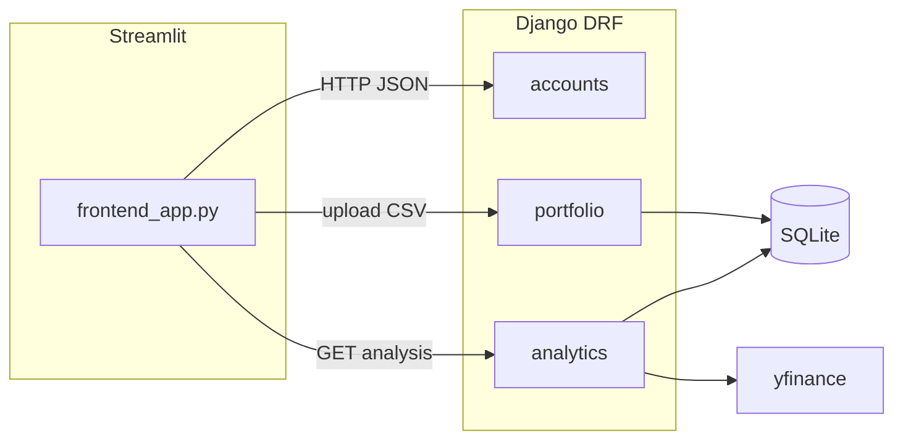

# Stock Portfolio Analyzer — Implementation Plan

## Architecture (high level)

## 1. Repository layout (clean, flat `manage.py` root)

Create this structure at [d:\portfolio-analyzer](d:\portfolio-analyzer):

- `manage.py`
- `requirements.txt` — versions as specified (pin compatible Django 4.2 LTS + DRF 3.14+ for stability)
- `README.md` — venv, `migrate`, `createsuperuser`, runserver, Streamlit, env vars (`API_BASE_URL`, optional `DJANGO_SECRET_KEY`)
- `portfolio_analyzer/` — Django project package: `settings.py`, `urls.py`, `wsgi.py`, `asgi.py`
- `accounts/` — custom user, auth serializers/views, admin
- `portfolio/` — `Holding` model, CSV upload API
- `analytics/` — read-only analytics (no extra DB model required; compute from `Holding` + yfinance)
- `frontend_app.py` — Streamlit UI at repo root (as requested)

**Settings essentials:** Register `accounts`, `portfolio`, `analytics`, `rest_framework`, `rest_framework.autoken` (Token auth works cleanly with Streamlit `requests` + `Authorization` header). Set `AUTH_USER_MODEL = 'accounts.User'`, `DEFAULT_AUTO_FIELD`, timezone `Asia/Kolkata` (sensible default for `.NS` stocks).

**Why Token auth:** Production-friendly API access from Streamlit without cookie/CORS complexity; login endpoint returns a token; upload/analysis require `IsAuthenticated`.

---

## 2. Custom User model (`NOT AbstractUser`)

In [accounts/models.py](accounts/models.py):

- Subclass **`AbstractBaseUser`** + **`PermissionsMixin`** (standard replacement for `AbstractUser`).
- Fields: `email` (`EmailField`, `unique=True`), `name` (`CharField`), `is_admin` (`BooleanField`, default `False`), plus required `is_active`, `is_staff` (for Django admin if needed).
- Set `USERNAME_FIELD = 'email'`; `REQUIRED_FIELDS = ['name']`.
- Custom `UserManager` with `create_user` / `create_superuser` (email-based).
- **Note:** `password` is inherited from `AbstractBaseUser` (hashed); never store plain text.

Configure in [portfolio_analyzer/settings.py](portfolio_analyzer/settings.py): `AUTH_USER_MODEL = 'accounts.User'`.

**Serializers:** [accounts/serializers.py](accounts/serializers.py) — `UserSerializer` (read: id, email, name, is_admin), `RegisterSerializer` (email, name, password with `write_only=True`, `create()` calls `User.objects.create_user`), `LoginSerializer` (email, password) used only to validate before token issuance.

**Views:** Register + Login (return DRF `Token` key). Optional `me/` endpoint for current user.

**URLs:** e.g. `accounts/urls.py` with `register/`, `login/`; include under `api/auth/` or project root — document in README.

---

## 3. Portfolio model

In [portfolio/models.py](portfolio/models.py):

- `Holding`: `user` → `ForeignKey(settings.AUTH_USER_MODEL, on_delete=CASCADE, related_name='holdings')`, `stock_name` (`CharField`), `quantity` (`DecimalField`), `buy_price` (`DecimalField`), `buy_date` (`DateField`).
- `Meta`: `ordering = ['-buy_date']`; optional `unique_together` omitted so CSV can represent multiple lots (better for XIRR).

**Serializers:** `HoldingSerializer` for list/create; upload response serializer with `holdings_created` count and list of created rows.

---

## 4. CSV upload API (`/upload/`)

In [portfolio/views.py](portfolio/views.py):

- `POST`, `multipart/form-data`, `IsAuthenticated`, `parser_classes` including `MultiPartParser`.
- Read uploaded file into **pandas** `read_csv`; required columns exactly: `stock_name`, `quantity`, `buy_price`, `buy_date`.
- Validate: non-empty; parse `buy_date` with `pd.to_datetime(..., dayfirst=True)` or explicit format + errors; coerce `quantity`/`buy_price` to `Decimal`; strip strings.
- **Replace vs append:** Implement **replace portfolio** for authenticated user (delete existing `Holding` rows for user, then bulk create) so repeated uploads are predictable — document in README.
- Return JSON: `{ "success": true, "message": "...", "holdings_created": N, "holdings": [ ... ] }` on success.

**Errors:** 400 with `{ "success": false, "error": "...", "details": [...] }` for bad CSV/missing columns/invalid rows.

---

## 5. Live prices (yfinance, Indian `.NS`)

Shared utility module e.g. [analytics/services.py](analytics/services.py) or [portfolio/utils.py](portfolio/utils.py):

- Normalize ticker: strip whitespace; if symbol does not end with `.NS` / `.BO`, **default append `.NS`** (NSE) per your example (`RELIANCE` → `RELIANCE.NS`).
- `yfinance.Ticker(symbol).fast_info` or `.history(period='1d')` for last close; handle failures (delisted, network) — return `None` for price and flag `price_available: false` in API for that row (no crash).

---

## 6. Analytics API (`/analysis/`)

In [analytics/views.py](analytics/views.py):

- `GET`, `IsAuthenticated`.
- Load user’s `Holding` queryset; for each row compute:
  - **Investment** = `quantity * buy_price`
  - **Current value** = `quantity * current_price` (skip or zero if price missing; document behavior)
  - **P/L** and **P/L %** per stock (**bonus**)
- **Totals:** sum investment, sum current value, total P/L, total P/L %.

**XIRR (pyxirr):** Build portfolio-level cash flows:

- For each holding (each lot): negative cash flow on `buy_date` = `-quantity * buy_price`
- Positive flow on **today** = sum of current market values of all positions (single terminal inflow)

Use `pyxirr.xirr(dates, amounts)`; if insufficient data or library raises, return `xirr: null` and a string `xirr_error` — do not fail the whole response.

**Response shape (clean JSON, nested serializers):**

- `summary`: total_investment, current_value, profit_loss, profit_loss_percent, xirr (optional)
- `stocks`: array of `{ stock_name, ticker_used, quantity, buy_price, buy_date, investment, current_price, current_value, profit_loss, profit_loss_percent, price_available }`

Use DRF `Serializer` classes in [analytics/serializers.py](analytics/serializers.py) for stable schema.

---

## 7. URL routing

In [portfolio_analyzer/urls.py](portfolio_analyzer/urls.py):

- `path('upload/', ...)` → portfolio upload view
- `path('analysis/', ...)` → analytics view
- Include auth routes (e.g. `path('api/auth/', include('accounts.urls'))`) — exact paths documented in README

Match your requirement for top-level **`/upload/`** and **`/analysis/`**.

---

## 8. Streamlit frontend ([frontend_app.py](frontend_app.py))

- Sidebar or main: **Register** / **Login** (email, password); store **token** in `st.session_state`.
- File uploader for CSV; `requests.post(f"{API_BASE_URL}/upload/", headers={"Authorization": f"Token {token}"}, files={...})`
- Button to **Refresh analysis**: `GET` `/analysis/` with same header.
- Display: metrics (total investment, current value, profit, XIRR if present).
- **matplotlib** figure: bar chart (e.g. per-stock current value or P/L — label clearly).
- **Table:** `st.dataframe` from `stocks` array.
- Config: `API_BASE_URL` from `st.secrets` or `os.environ`, default `http://127.0.0.1:8000`.

---

## 9. Error handling (explicit behavior)

| Case | Behavior |
|------|----------|
| Invalid CSV / wrong columns | 400 + structured error message |
| yfinance failure per ticker | Include row with `price_available: false`; totals use only known prices (document whether unknown prices count as 0 or excluded — **recommend exclude from current value sum** and show warning count) |
| XIRR impossible | `xirr: null`, no 500 |
| Unauthenticated | 401 on upload/analysis |

---

## 10. `requirements.txt`

Include exactly your list (with pinned versions in implementation for reproducibility):

`django`, `djangorestframework`, `pandas`, `yfinance`, `matplotlib`, `streamlit`, `pyxirr`

(Optional small add: `requests` for Streamlit HTTP client — standard; if you prefer stdlib only, `urllib` is possible but `requests` is clearer.)

---

## 11. `README.md`

- Python 3.10+
- Create venv, `pip install -r requirements.txt`
- `python manage.py migrate`
- `python manage.py createsuperuser` (optional)
- `python manage.py runserver`
- `streamlit run frontend_app.py`
- Example CSV block matching `stock_name,quantity,buy_price,buy_date`
- Note: first-time user registers via API/UI, then uploads

---

## 12. Bonus (built into serializers/API)

- Per-stock P/L and P/L % in `stocks[]`
- Consistent success/error JSON
- DRF serializers for all responses; no raw dicts in views except mapping to serializer validated data

---

## 13. Files not to skip

| Area | Files |
|------|--------|
| Project | `manage.py`, `portfolio_analyzer/*` |
| Apps | Each app: `apps.py`, `models.py`, `admin.py`, `serializers.py` (where needed), `views.py`, `urls.py` |
| DB | Migrations generated after models (`accounts/migrations/`, `portfolio/migrations/`) |
| Auth | Token table migration via `authtoken` |
| Front | `frontend_app.py` |
| Docs | `requirements.txt`, `README.md` |

---

## 14. Post-implementation verification (manual)

1. `migrate` — no errors  
2. Register + login — token returned  
3. Upload sample CSV — 200 + holdings count  
4. GET `/analysis/` — totals + chart data in Streamlit  
5. Invalid CSV — 400, app still stable  

---

## Implementation order (recommended)

1. Django project + apps + settings + custom user + migrations  
2. `Holding` model + migrations  
3. Token auth + register/login  
4. CSV upload + parsing + tests via curl/Streamlit  
5. yfinance helper + analytics + XIRR  
6. Wire URLs + polish serializers  
7. Streamlit UI + README  

No placeholder endpoints: every route returns real data or a defined error body after step 5–6.
